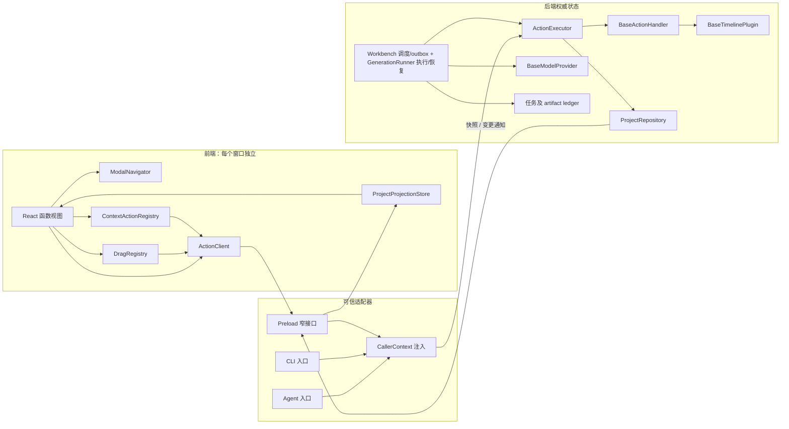
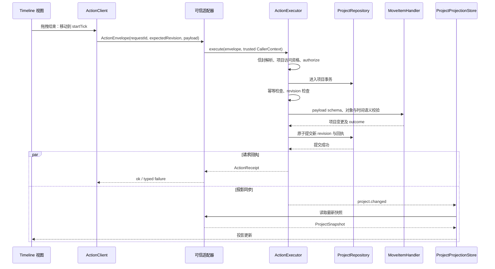

# Pixel 核心前后端基类设计

这份设计把《生成视频软件理解》中的交互约束落实为 TypeScript 核心骨架。重点是对象、动作、插件和生成任务之间的边界；Electron 窗口与 React 页面可以在这些边界上实现。

长期产品基线与防漂移规则见 [设计哲学与架构约束](design-philosophy.zh-CN.md)。本文记录具体实现方案；新增能力、交互入口或调整前后端边界时，先按该文档评审，再同步这里的契约与实现状态。

当前交付包含核心契约、五模型官方 SDK、本地文件工作台、React 界面和可启动的 Electron 桌面宿主。`src/workbench.ts` 已组合项目持久化、生成提交/outbox及内部结果挂载；本文件中标为骨架或目标的示例类仍可独立使用，不代表完整工作台的当前状态。SDK 已用模拟 HTTP 验证，尚未进行付费生成测试。参数、配置及诊断 CLI 见[模型接入与执行边界](model-integrations.zh-CN.md)，运行及独立详情窗口见[本地桌面与像素界面](desktop-ui.zh-CN.md)。当前实际使用 Electron、React、TypeScript、Vite 和 Zod；Radix、Zustand 与 dnd-kit 仍是可选方案。

## 1. 先固定产品中的对象与操作

产品采用固定单路径：双击进入对象详情，右键发起离散命令，拖拽建立关系。默认主界面只有 Viewer 与 Timeline，保留当前项目标题及必要窗口控制；不常驻资产库、模型参数、色板、版本、手势教程、配置或调试信息。新项目为空，空 Viewer 不预置示例画面或假波形。具体纠偏依据见[哲学对齐记录](philosophy-alignment.zh-CN.md)。

| 对象或区域 | 双击 | 右键 | 拖拽 |
| --- | --- | --- | --- |
| Project | 进入项目详情 | 项目命令 | 项目文件拖入主窗口以打开项目 |
| Timeline 区域 | 进入时间线详情 | 工作区空白处 → 新建时间线 → 选择模型；已有 Timeline 时间位置 → 新建生成草稿；已有对象显示适用命令 | Asset 拖入放置已有素材、item 本体拖入移动位置 |
| Timeline item | 进入参数及输出详情 | 生成、重新生成、复制、删除等 | 拖边缘修改时间范围；Asset 拖入引用区域建立 Reference；item 拖入资产库保存为资产 |
| 资产库 | 双击资产进入详情 | 资产及资源库命令 | 外部媒体拖入导入资产 |
| Asset | 进入媒体详情 | 素材命令 | 建立 item 的参考素材关系 |
| Viewer | 进入输出详情 | 输出相关命令 | 拖出已经准备好的真实文件 |

模型不是可拖到时间线上的媒体对象。新建操作从 Timeline 工作区空白处的右键菜单进入“新建时间线”，选择模型后执行 `timeline.create`，只创建该模型对应的空 Timeline，不隐式附送 Item 或提示词。生成新内容的标准路径是已有 Timeline 时间位置右键 → 新建生成草稿，提交 `item.createDraft`，只接受 `timelineId` 与 `startTick`，不接受 `assetId`，结果是不带输出的 Item。放置已有素材的标准路径是 Asset → Timeline 时间位置，提交带 `assetId` 的 `item.create`，结果是已关联该素材的 Item。插件为两者提供默认数据及约束；参数编辑随后发生在 Item 详情中。

两条 GUI 路径具有不同前置对象和业务结果：从模型与时间位置发起生成草稿，从既有素材发起放置。`item.createDraft` 严格拒绝资产参数，`item.create` 要求资产；两者共享创建内核、插件校验、位置不变量和事务规则。已有项目数据及已保存的幂等记录不受影响。正式项目 CLI / Agent 接线时必须复用这些 Action 与校验；这些适配器尚未实现。

资产库的唯一 GUI 进入路径为双击项目标题 → 作品详情 → 双击素材库。库内关系拖拽时，宿主在当前顶部详情作用域临时呈现已存在的 Timeline / Item 目标，复用 Asset → Timeline、Asset → Item 引用和 Item → Library 的既有角色路由；背景及旧详情层仍被隔离。上表也包含产品目标路径，例如项目文件拖入打开；当前完成状态以第 10 节为准。

对象关系保持浅层：

```text
ProjectDocument
  ├─ timelines: TimelineData
  │    └─ itemIds → TimelineItemData
  └─ assets: AssetData
       ↑ item.referenceAssetIds / item.outputAssetId
```

`TimelineItemData` 是“整数时间区间 + 插件参数 + 素材关系”的通用数据结构。Video timeline 中的 Clip 是一种 item；本地示例使用 `video.clip`，真实模型插件另声明 `audio.speech`、`audio.soundEffect`、`audio.music`、`video.generated` 与 `image.generated`。音乐、对白或其他 Timeline item 使用各自的 `kind` 和参数，不能被迫继承 `VideoClip`。时间统一使用整数 tick，区间为 `[startTick, startTick + durationTicks)`；Timeline 持久化每秒 tick 数。Item 的合成区间与模型生成时长分别校验，不能将静态图像或自然语音硬套成固定时长的视频请求。

## 2. 基类只复用行为

领域数据使用接口和可序列化对象，React 视图使用函数组件。只有确实需要一套执行流程的扩展点使用抽象基类：动作处理器、Timeline 插件和模型 provider。其他宿主服务使用组合，不构造 `BaseEntity → BaseNode → BaseMedia → BaseClip` 这样的继承树。

| 层 | 类或接口 | 核心职责 | 不承担的职责 |
| --- | --- | --- | --- |
| 共享契约 | `ProjectDocument` / `TimelineData` / `TimelineItemData` / `AssetData` | 项目文件和 IPC 共同使用的纯数据 | React 状态、文件访问、网络请求 |
| 能力查询契约 | `CapabilityCatalog` / `ActionCapability` | 给 GUI 与 Agent 提供同一后端语义目录 | 独立的 Agent 动作体系、已实现的查询服务 |
| 前端 | `ActionClient` | 校验显式请求、通过桥接接口提交动作 | 推断选择对象、自动重试、声明调用者权限 |
| 前端 | `ProjectProjectionStore` | 维护后端快照的镜像、处理 revision 与重新读取 | 持久化、业务校验、撤销历史 |
| 前端 | `ModalNavigator` | 保存唯一详情 path，管理 push/pop 和 Esc 返回 | 执行业务动作、全局项目状态 |
| 前端 | `ContextActionRegistry` | 从对象上下文收集右键语义命令及可用状态 | 作为后端权限检查的替代 |
| 前端 | `DragRegistry` | 将有效拖拽关系转换为统一动作 | 自行访问文件或绕过 Action System |
| 前端 | `GuiActionPathRegistry` | 宿主统一登记一个动作的唯一 GUI 路径 | 限制 CLI 或 Agent 调用动作 |
| 前端契约 | `NativeDragBroker` | 定义跨窗口拖拽会话的创建、解析、结束 | 已完成的原生拖拽实现 |
| 后端 | `BaseActionHandler` | 约束单个动作的输入校验、权限和项目更新流程 | IPC、React、模型轮询 |
| 后端 | `ActionRegistry` | 按动作 type 注册唯一处理器 | 右键菜单与页面布局 |
| 后端 | `ActionExecutor` | 统一执行入口，协调 revision、幂等、事务和变更通知 | 了解具体 UI 手势 |
| 后端 | `ProjectRepository` | 项目权威数据与事务边界 | 生成任务状态 |
| 后端示例 | `MemoryProjectRepository` | 内存中演示事务与并发语义 | 崩溃恢复、磁盘持久化 |
| 后端示例 | `MoveItemHandler` | 校验并执行 item 的时间位置移动 | 所有剪辑编辑命令 |
| 插件 | `BaseTimelinePlugin` | 声明 item 种类、字段、schema，创建纯数据并检查版本 | 任意页面视觉、自行写项目、自动迁移 |
| 插件示例 | `VideoTimelinePlugin` | 视频 item 的时间与参数语义 | 规定所有 Timeline 必须是视频 |
| 模型目录 / 插件 | `ModelRegistry` / `ModelTimelinePlugin` | 五模型的 schema、字段、参数规范化、查询和独立 Item 语义 | 另建 GUI 路径、读取凭证或写项目 |
| 模型 | `BaseModelProvider` | 公共 `generate()` 校验、总超时、取消、错误脱敏与产物归属；受保护的 `performGeneration()` 扩展点 | 项目修改和调度 |
| 模型适配器 | `ElevenLabsModelProvider` / `OpenRouterModelProvider` | 官方 SDK 调用、流存储与异步视频查询 | renderer 凭证、项目事务或自动付费重试 |
| 任务契约 | `GenerationJob` / `GenerationArtifact` | 可持久化任务、执行状态和输出记录 | 进入项目的 undo 栈 |
| 任务接口 | `GenerationCoordinator` / `JobRepository` / `ArtifactStore` | 规定调度、原子状态更新和输出存储边界 | 声称完整 coordinator 已实现 |
| 后端执行 / 文件适配器 | `GenerationRunner` / `FileJobRepository` / `FileArtifactStore` | 执行/恢复捕获请求，单进程任务持久化与真实媒体保存 | 项目/outbox 联合事务、自动调度或多进程数据库锁 |
| 生成纯函数 | `transitionJob` / `isJobAttemptCurrent` / `getGenerationResultStaleness` / `isArtifactOwnedByJob` | 校验状态转换、旧 attempt、项目结果有效性及产物归属 | 替代提交时的原子检查 |

上述名称对应代码中的核心模块。`GenerationRunner`、任务 ledger 与产物存储可独立使用；项目持久化、Electron 宿主、生成提交/outbox 与受控结果挂载已由 `src/workbench.ts` 组合实现。基础类表不代表组合层已完成的能力仍待实现，也不代表正式项目 CLI / Agent 已接线。

基础 `backend.ts` 骨架内置示例 handler 为 `item.move`；工作台在 `src/workbench.ts` 另行注册时间线、片段、素材及生成动作，复用同一执行器。插件 manifest 声明的 `supportedActions` 仍表示语义能力，不等于所有声明都已实现。

## 3. 依赖方向

下图描述统一入口的目标依赖方向；GUI 已接入，正式项目 CLI / Agent 的可信适配器仍待实现。



GUI、正式项目 CLI 和 Agent 的架构约束是提交相同 `ActionEnvelope`。适配器负责认证和传输，业务处理器只看到可信 `CallerContext` 与可序列化参数。当前 GUI 经 `HttpDesktopBridge` → `Workbench.execute()` → `ActionExecutor` 提交；正式项目 CLI / Agent 仍待接线。`examples/generate-media.ts` 是使用 `backend-example` 请求的诊断 CLI，直接调用生成执行内核，不编辑 GUI 项目，也不能用诊断成功代替项目 Action 工作流验证。

能力发现也共用一个后端语义目录。`CapabilityCatalog.query(target, options, caller)` 按对象、插件和可信权限返回动作 type、说明、payload JSON Schema 与可用性。`CapabilityQuery` 的 limit 默认 5、最大 20，支持 cursor 和 exclude，便于逐步发现而不是每次注入全部动作。该 Action 查询服务仍只有接口与 schema；模型侧 `ModelRegistry.query()` 已提供有界查询及纯数据描述，包含 params/settings JSON Schema 与字段，供未来目录服务组合使用。前端 `ContextActionRegistry` 负责 GUI 路径绑定和 Modal scope；其可用性应接入共享 policy 或目录查询，避免另写一套与 Agent 不一致的规则。

## 4. 权威状态、前端镜像与 IPC

后端 repository 拥有项目权威状态。前端投影包含 `revision` 和项目快照；视图中的选择、缩放、滚动、临时拖拽位置、详情 path 和未提交表单属于每个窗口的局部 UI 状态，不写入项目文件。

前端镜像发生缺口、窗口恢复或动作返回冲突时，重新拉取快照。当前 `ProjectProjectionStore.start()` 先订阅，再读取完整快照；收到更高 revision 的 `project.changed` 后调用 `refresh()`。已知更高 revision 后返回的旧快照会被丢弃，避免乱序响应回滚镜像。后续只有在项目规模需要时才增加带 base revision 的 patch 协议。前端不得用“手势完成”证明后端已经提交；请求回执和投影读取是两个不同步骤。

`DesktopBridge` 的领域契约为 `dispatch(envelope)`、`readProject(projectId)` 和 `subscribeProject(projectId, listener)`。当前浏览器及桌面通过 `HttpDesktopBridge` 使用同一后端 API，桌面额外验证宿主签发的会话 Cookie。preload 只暴露窗口操作、详情打开及受控导出方法，使用 `ipcRenderer.invoke` / `ipcMain.handle` 等固定 channel，不暴露任意 channel 的 `ipcRenderer`。此边界遵循 [Electron 官方 IPC 文档](https://www.electronjs.org/docs/latest/tutorial/ipc) 的窄接口模式。

可信宿主/服务入口校验调用来源、项目访问资格和请求体，再构造 `CallerContext`，包含受信任的 `actorId`、`source`、`projectIds` 和权限集合。Electron 主进程校验窗口 IPC sender；当前 HTTP Action 的调用身份由 `Workbench` 服务入口注入。执行器在提交前检查项目访问资格与 handler 的 `authorize()`，幂等重放也经过这一步。renderer 提供的身份、权限或 `internal` 标志都不是授权依据。正式 CLI 和 Agent 接线时也必须由可信入口构造上下文。provider 凭证和任意文件路径留在后端；`AssetData.fileRef` 是由后端解析的句柄。

Zod 位于不可信数据进入后端的边界：信封先按严格 schema 解析，payload 再由 handler 或插件的 schema 解析；TypeScript 类型本身不能验证运行时输入。所用的严格对象和 JSON schema 见 [Zod 官方 schema 文档](https://zod.dev/api)。插件也不得仅靠前端字段约束保护项目数据。

## 5. 同步动作：以移动 item 为例



拖动期间可以显示临时位置；完成手势时只提交一次动作。失败后恢复投影位置，并把可理解的原因显示在该对象附近或命令上下文中。表单编辑可按字段提交，或在明确的完成手势中批量提交，需保证只有一个可预期的行为。

`DragRegistry.drop()` 和 `ContextActionRegistry.commandFor()` 只返回 `{ type, payload }`。调用点显式补充 `projectId`、`requestId` 和投影中的 `expectedRevision`，再调用 `ActionClient.execute()`。两种 registry 在组合根中共享一个 `GuiActionPathRegistry`，避免同一个动作同时绑定右键和拖拽；两者也应共享当前窗口的 `ModalNavigator`，执行顶部作用域检查。

回执与变更事件经过不同传输路径时，前端不依赖二者的到达顺序，只根据 revision 接受新快照。当前执行器把通知失败交给日志回调，不会将已经提交成功的动作伪装为失败；窗口恢复时仍需显式刷新快照。

`expectedRevision` 表示用户基于哪个快照发起编辑。revision 不匹配时返回 `REVISION_CONFLICT`，前端刷新后由使用者重试；不要自动把具有不同语义的命令静默重放。事务必须同时提交项目和成功回执，避免“项目已改，但重试又改一次”。

当前 `MoveItemHandler` 的动作 type 为 `item.move`，payload 为 `{ itemId, startTick }`。它只移动当前 Timeline 内的位置，并接受宿主注入的只读位置校验策略。这个示例面向放置位置仅影响合成、不影响生成输入的模型；若某模型把位置作为生成输入，需要专用 handler 或明确的 token 更新策略扩展，不能仅靠现有只读校验策略完成。

`requestId` 用于同一次请求的重试，作用域为 `(projectId, actorId, requestId)`。整个信封包含 `expectedRevision`，采用规范 JSON 比较：完全相同的请求返回原回执，不再产生变更事件或历史；同一个 ID 对应不同信封返回 `REQUEST_ID_REUSED`。网络重试应保留原始信封；读取新 revision 后重新执行属于新的请求。持久化实现需要保存请求回执和规范化请求指纹。权限校验仍必须成立，不能把缓存回执当作授权。

## 6. 生成是独立任务，完成后通过动作应用

生成可能比项目编辑长很多。不要把网络请求放在项目事务中，也不要把每次进度写入项目 revision。`GenerationJob` 放入独立 ledger，记录请求快照、provider 版本、供应商任务 ID、attempt、状态和 artifact 关联。


此序列已经由 `Workbench` 组合实现：项目提交及 outbox、runner 消费、文件产物保存和内部 Action 挂载保持独立边界。`GenerationRunner` 可独立执行与恢复捕获请求。`BaseModelProvider.generate()` 统一严格解析、模型规范化、适用性检查、总超时、取消、错误脱敏及产物归属；供应商扩展受保护的 `performGeneration()`。`ProviderRunContext` 含 `AbortSignal`、attempt token、进度回调、受控 `ArtifactWriter` / `MediaReader`、已保存的 `providerTaskId` 和需等待的 `checkpointProviderTask()`，由宿主管理 ID、文件句柄和持久化。

`GenerationRequest` 除 params 与 Asset 引用外，捕获可选 `settings` 和模型生成 `durationMs`；引用可声明 reference / first-frame / last-frame 角色，再由模型能力拒绝不支持的组合。三个音频模型不接收 Asset 引用；两个 OpenRouter 模型只接受图片。模型 params 的单位、默认值、角色和数量约束集中于 `ModelRegistry.prepareRequest()`，详见模型接入文档。后端配置只读取必要的 `.env` 密钥，不把整个环境注入前端。

提交生成时必须在同一事务保存新 token 与 job 或 outbox，提交成功后 worker 才消费。否则崩溃可能留下新 token 却没有任务，或者任务基于尚未提交的输入开始执行。当前 `FileWorkbenchRepository` 将项目及 outbox 保存在同一持久化提交中，再由 `Workbench` 转换并消费独立任务 ledger。基础 `ProjectRepository.commit()` 骨架仍只提供文档编辑事务；其接口示例不替代工作台的联合提交实现。

`generationToken` 标识一次当前生成输入的有效性；影响输入的编辑或重新生成均换新 token，撤销也生成新 token，不能复用历史 token。`inputFingerprint` 对捕获的模型、参数、引用和时间语义生成稳定指纹，用于结果检查和可能的缓存。任务执行使用捕获的 request，不能中途读取 item 的最新参数。

生成结束首先保存 artifact，再检查是否可以关联到当前 item。`getGenerationResultStaleness()` 已实现纯检查：任务必须成功、project 和目标必须匹配、token 及后端计算的当前 fingerprint 必须仍一致；传入 attempt token 时还检查是否为旧 attempt。它不比较全局 revision，不相关的时间线编辑不应使生成结果过期。工作台的 `generation.applyResult` handler 已在提交事务内执行这些检查，并用 `isArtifactOwnedByJob()` 验证 artifact 的 job ID 与成功产物列表。

结果过期时，任务的成功输出仍存在，但不会覆盖用户后来的编辑。artifact 的清理、保留和重新关联另行定义。结果挂载动作名为 `generation.applyResult`，所需权限为 `generation.apply`，只授予后端内部执行入口；renderer 不能通过声称任务完成而上传任意输出路径。

任务终态为 `succeeded`、`failed` 和 `canceled`；终态记录不重新打开。`cancelRequested` 只能转为 `canceled`，供应商迟到的成功回调不能把它改成成功。`interrupted` 是可恢复状态，恢复到 `queued` 时 `transitionJob()` 递增 attempt、清除旧执行结果并保留已经持久化的 `providerTaskId`；恢复继续查询该远端任务。对失败或取消任务重试需创建新 job ID，本次 runner 不自动重试。

每次进度、产物写入与完成回调携带 `(jobId, attempt)`，先用 `isJobAttemptCurrent()` 过滤，再通过 `JobRepository.update()` 的原子 guard 检查当前 attempt 和状态，防止旧 worker 覆盖恢复后的任务。Wan 在任务 ID checkpoint 持久化完成后才轮询；`GenerationRunner.resume()` 支持重启后继续已有远端任务，没有任务 ID 时不盲目再次提交。远端失败、取消或过期是 `REMOTE_FAILED` 终态，不当作中断恢复。当前文件适配器提供单进程任务/媒体保存；工作台启动时消费已持久化的 outbox，已中断的远端任务由对象右键显式恢复，没有远端任务 ID 时不盲目重提。取消是否已经终止供应商任务由 provider 的能力决定，不把本地取消成功等同于供应商没有计费。

## 7. revision、幂等与 undo/redo 的边界

| 状态 | revision | undo/redo | 说明 |
| --- | --- | --- | --- |
| 项目结构、item 参数、素材关系 | 修改时递增 | 可设计为可撤销 | 后端事务内记录 |
| 生成任务状态、进度与失败，仅更新 ledger | 不增加项目 revision | 不进入项目撤销栈 | 提交时若换项目 token，仍按项目编辑计 revision |
| 将输出关联到 item | 修改项目时递增 | 可撤销关联 | 不删除已生成文件 |
| 选择、Modal path、滚动和拖拽预览 | 不增加 | 不进入 | 每个窗口局部状态 |
| 外部模型调用和已发生的费用 | 不增加 | 不能靠 undo 撤回 | 取消是单独命令 |

回执里的 `undoable` 是动作能力描述。当前内存 repository 记录 before/after 历史，`HistoryService` 只提供接口，尚未实现 replay。完整的 undo/redo 服务还需要逆操作或受控快照、redo 栈以及分组规则，不能仅有这个布尔值就算已实现。undo 和 redo 都是新的事务、产生新的 revision；任何影响生成有效性的恢复必须重新计算 token。MVP 可以先完成单项目串行历史，不必引入多人协作操作变换。

项目内存示例便于验证语义；持久化 repository 需要把项目、revision、幂等回执和撤销历史放在同一提交边界中。生成提交还要保证上述 token 与 job/outbox 的原子性。生成完成阶段先持久化 artifact 和成功任务，再通过可重复执行的内部应用动作关联输出，以恢复“输出已生成但尚未挂载”的中断。

## 8. 插件扩展与版本迁移

Timeline 插件只声明语义：支持的 item kind、默认数据、字段 schema、时间限制与可用命令。`createTimeline()` 校验模型并构造空时间线数据，`createItem()` 构造并校验 item 数据，两者都不自行写入项目；宿主 handler 在事务中维护成员关系、素材存在性和重叠规则。宿主统一渲染参数字段、菜单、拖拽提示、错误和详情布局，保持无按钮和固定路径规则。插件扩展新字段不应带来新的视觉框架。`VideoTimelinePlugin` 仍是 `example.video` 的本地示例；真实五模型另通过 `ModelTimelinePlugin` 声明各自的参数与输出。

`PluginFieldDeclaration` 已支持 object / array、子字段 children、条件呈现 visibleWhen 和 nullable；例如 voiceSettings 与 music compositionPlan 可通过同一详情宿主逐层显示。草稿默认值与生成必填校验分开，Asset→Timeline 的 Item 构造不必编造 prompt 或 voiceId。音频 outputFormat 仅放 Item params，Wan/Grok 共用的画面设置放 Timeline settings，没有第二个同义参数入口。

`TimelineData.pluginId` 和 `pluginVersion` 写入项目；`ProjectDocument.schemaVersion` 管理宿主的数据结构。当前 `createItem()` 检查插件 ID、模型和 schema 版本，不匹配版本时拒绝创建，要求显式迁移；`BaseTimelinePlugin` 尚无迁移方法。

迁移器属于下一步设计：打开项目时先验证宿主 schema，再从旧版本顺序迁移插件数据，最后按当前版本 schema 校验。迁移应确定、纯数据化、可测试，并在新副本中完成后原子保存。遇到缺失插件或更高版本时保留原始参数，以只读占位对象呈现，避免静默丢字段。

Zod schema、方法和 provider 实例属于进程内的 registry，不能直接存入项目文件。项目中只存插件 ID、版本和 JSON 参数。第一阶段插件是随应用发布的可信代码；第三方插件执行隔离、签名及权限系统尚未实现，不把普通 TypeScript 基类视为沙箱。

## 9. Modal 与拖拽隔离

每个窗口只有一个 `ModalHost`，其内容由 `ModalNavigator.path` 最后一项决定。双击子对象执行 push，Esc 执行 pop，空 path 关闭 Host；详情内部继续导航仍使用同一 Host。数据需要保存时通过 Action System 提交，path 本身不代表提交。未提交表单的离开规则应由宿主统一定义。

Modal 的 path、局部选中和表单状态只属于当前窗口。每个 `ModalFrame` 有独立 `scopeId`，当前 `isInteractive()` 只允许顶部 frame；无 Modal 时只允许工作区 scope。宿主将该检查用于背景右键、拖拽和编辑快捷键，防止同一次 drop 误改背景时间线。`reconcile()` 在对象删除后退回仍存在的祖先。Radix 可以用于焦点约束与弹层，但业务导航仍由 path 管理。

当前资产库是项目详情 path 的子视图。拖入素材、展示已有对象的关系目标、hover 及 drop 都带当前顶部 `scopeId`；新引用或放置仍通过同一个 `DragRegistry` 转成 Action。支持引用且存在关系或合法拖拽时才显示引用区，不支持引用的模型不显示该能力。库内的来源与目标位于同一个活动窗口，不依赖解除背景隔离，也不等于已实现 `NativeDragBroker`。

单窗口中的 dnd-kit 可管理手势；跨窗口拖拽不能共享一份 React 拖拽内存。当前 `NativeDragBroker` 仅是待实现契约：`begin()` 创建带过期时间的会话，DataTransfer 携带 session token，接收窗口 `resolve()` 用于 hover 预览；drop 必须调用 `consume()` 原子解析并消费 token，`end()` 负责结束及取消清理。来源和接收窗口身份由可信 IPC sender 绑定，后端在 drop 时重新校验对象存在、权限、来源与目标兼容性，再生成同一种动作。payload 不携带 provider 凭证、任意文件路径或可执行闭包。跨项目引用需要定义为复制/导入动作，不能直接保存指向另一项目的悬空 ID。

Viewer 拖出文件采用“提前准备输出，拖动时启动原生文件拖拽”的路径。`electron/export-tickets.mjs` 已实现当前媒体文件的提前准备，确认真实文件后签发绑定窗口、限时及单次使用的 ticket；用户开始拖拽时，主进程消费 ticket 后调用 `webContents.startDrag({ file, icon })`。完整时间线的合成导出仍待实现。Electron 的原生文件拖拽需要文件与图标，见 [Electron 官方 Native File Drag & Drop 文档](https://www.electronjs.org/docs/latest/tutorial/native-file-drag-drop)。不要等文件拖到外部应用以后才异步生成或导出文件。准备中显示对象状态，并暂时不允许拖出。

`DragRegistry` 的内部对象关系拖拽与原生文件拖出是两个适配边界。前者提交动作；后者由可信主进程使用已经验证的文件。它们共用产品的拖拽入口，但不混用权限和 payload。

## 10. 当前交付与 MVP 次序

当前目录同时保留核心骨架及完整本地工作台的组合实现。通过 `npm run desktop` 启动本地软件，`npm run package:win` 构建 Windows 可执行文件。相关验证为 `npm run typecheck`、`npm test`、`npm run test:ui` 与 `npm run test:desktop`。SDK 测试使用模拟 HTTP，不产生付费请求；`npm run generate` 会调用真实模型。

| 范围 | 当前状态 |
| --- | --- |
| 共享项目、动作、任务、artifact 契约 | 已实现 |
| GUI / Agent 共用 CapabilityCatalog 能力查询 | 仅接口与查询 schema |
| 正式项目 CLI / Agent 的可信 Action 适配器 | 待实现；诊断 CLI 不编辑 GUI 项目 |
| 动作执行器、输入校验、内存 repository 与移动示例 | 已实现核心骨架 |
| `timeline.create`、`item.createDraft`、`item.create`、`generation.submit` / `generation.applyResult` handler | `src/workbench.ts` 已实现；新项目为空，创建 Timeline 不隐式创建 Item；生成草稿显式创建，已有素材经拖拽放置；结果挂载仅内部调用 |
| 前端动作客户端、投影、path 导航、菜单与拖拽 registry | 已实现框架无关骨架；示例演示拖拽到投影的完整链路 |
| Timeline 插件、视频示例及五真实模型语义目录 | 已实现纯构造、字段/schema/defaults、有界查询与统一 GUI 字段宿主 |
| 模型 provider 执行模板及两官方 SDK 适配器 | 已实现总超时、取消、脱敏错误、产物守卫；模拟 HTTP 验证 |
| 任务状态转换、attempt 及结果有效性纯检查 | 已实现 |
| React Timeline、ModalHost、Viewer | 默认仅 Viewer + Timeline；已实现逐层详情、右键、字段、移动/边缘拖拽及顶部库作用域内导入/放置/引用/复用；完整合成播放待实现 |
| Electron main/preload、窗口隔离和跨窗口拖拽 | 原生主窗口、独立详情窗口、窄 preload 及父窗口隔离已实现；跨窗口对象 broker 待实现 |
| 任务/文件持久化及 Wan 远端任务恢复 | 已实现文件 ledger、产物存储和 runner run/resume；单后端进程 |
| 项目持久化、token 与 job/outbox 联合事务、自动调度 | 单机文件工作台已实现；事务保存 outbox 后消费，含启动恢复及旧结果守卫 |
| 插件 schema 版本迁移器与缺失插件占位 UI | 仅设计 |
| 真实 SDK 的后端诊断 CLI | 已实现参数文件输入、模型查询和已有任务恢复；直接执行 `backend-example` 捕获请求，不是项目 Action 适配器；未付费验证 |
| 项目内生成提交与结果应用 | Workbench 组合 runner 与内部 Action；runner 自身不直接修改项目 |
| 完整 undo/redo、导出准备和原生拖出 | 当前媒体的导出 ticket 与原生拖出已实现；完整 undo/redo 及合成导出待实现 |

下一步在现有本地闭环上继续推进：

1. 增加项目文件拖入打开、版本迁移与缺失插件占位。
2. 实现项目 undo/redo 的受控重放及 token 更新。
3. 实现完整 Timeline 合成播放与导出，沿用 Viewer 唯一原生拖出手势。
4. 根据跨窗口对象关系的实际需求实现 `NativeDragBroker`，保持原生 Modal 背景隔离。
5. 扩展 Agent 能力发现与可信适配器，继续复用 Action 与业务规则。

第一版不需要微服务、通用工作流图或复杂继承系统。已有边界足以在单机 Electron 后端内逐步扩展，后续迁移远程生成服务时仍保留同一动作与任务契约。
