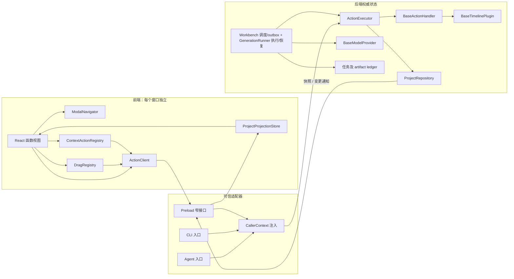
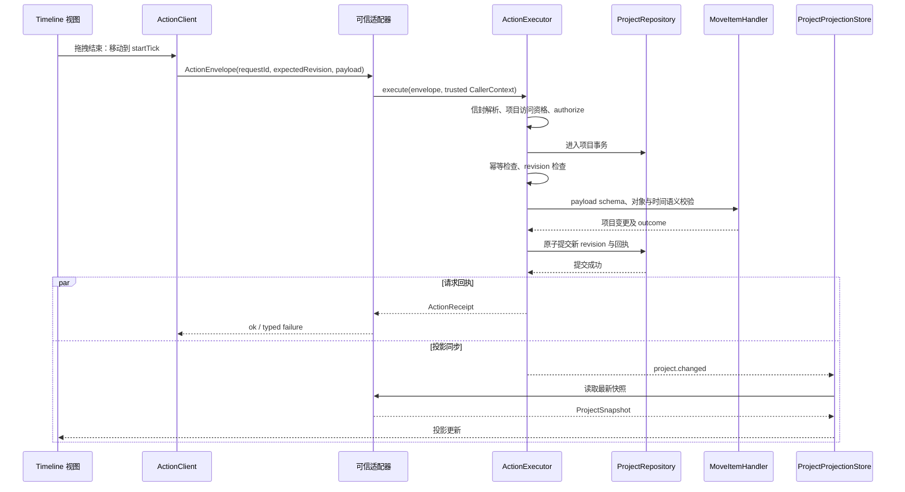
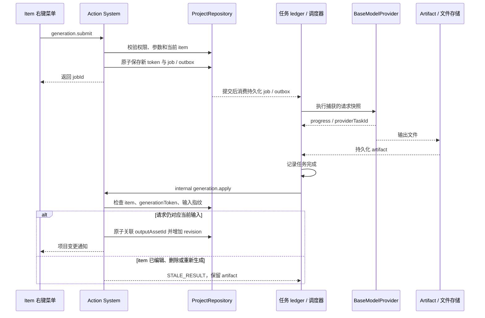

# Pixel 核心前后端基类设计

这份设计把《生成视频软件理解》中的交互约束落实为 TypeScript 核心骨架。重点是对象、动作、插件和生成任务之间的边界；Electron 窗口与 React 页面可以在这些边界上实现。

长期产品基线与防漂移规则见 [设计哲学与架构约束](design-philosophy.zh-CN.md)。本文记录具体实现方案；新增能力、交互入口或调整前后端边界时，先按该文档评审，再同步这里的契约与实现状态。

1.5 已加入纯文本参考与普通视频 / 音频 / 图片轨道，使用相同 Timeline 基类、目录和 Action；外部文本读取提供共享只读投影、HTTP 与离线命令。扩展职责、直接媒体放置的基线取舍及最终验证见[本地时间线与扩展边界](local-timelines-and-extension.zh-CN.md)。

1.6 在这一基础上加入素材库自定义分组、持久化轨道顺序、真实媒体多轨叠加预览、声明驱动的声音选择与参考上传，以及按实际高度分栏的上下文菜单。必要的播放、排序、上传和对象编辑控件按用户要求可见，仍受对象、作用域、共享 Action 与统一视觉约束；相关基线修正见设计哲学 1.6，具体实施与许可边界见[声纹、输入、分组与叠加预览](voices-inputs-groups-and-composition.zh-CN.md)。

当前交付包含核心契约、五模型官方 SDK、Seafile 共享项目及资源工作台、React 界面和 Electron 桌面宿主。workbench 组合项目持久化、生成提交/outbox及内部结果挂载；目标示例不代表正式项目 CLI/Agent 已接线。SDK 模拟 HTTP 验证，未付费生成。配置见[模型接入文档](model-integrations.zh-CN.md)，运行见[桌面说明](desktop-ui.zh-CN.md)。实际使用 Electron、React、TypeScript、Vite、Zod、dnd-kit、Remotion 和 fflate。

1.7 的满轨创建、普通媒体 picker、人工输出与 Seafile 媒体作为[历史记录](shared-resources-and-manual-output.zh-CN.md)保留。1.8 按用户要求取消本地项目文件系统，项目/历史/回执/outbox/任务/声纹记录统一 Seafile；素材库升级项目管理器，提供可编辑整项目/单轨工程包和 SHA256 移动恢复。生产无本地项目/资源回退，共享版本发布和单编辑宿主 lease 保护团队并发；见[共享项目管理与工程包](shared-project-manager-and-packages.zh-CN.md)。

## 1. 先固定产品中的对象与操作

产品采用稳定对象语法：双击进入对象详情，右键发起上下文命令，拖拽表达空间操作或关系；1.4 按用户要求增加限定于 Timeline 左侧的单击默认配置导航例外。1.6 允许相关上下文中的必要可见操作，不通过隐藏按钮牺牲可发现性；同一业务仍只有一个权威处理入口，手势及可见控件不能各写一套规则。默认主工作区仍由 Viewer 与 Timeline 构成，保留当前项目标题、必要窗口控制、播放控件和轨道排序手柄；素材库和模型参数按上下文出现。新项目为空，空 Viewer 不预置示例画面或假波形。具体历史纠偏依据见[哲学对齐记录](philosophy-alignment.zh-CN.md)，当前产品基线以设计哲学 1.8 为准。

| 对象或区域 | 双击 | 右键 | 拖拽 |
| --- | --- | --- | --- |
| Project | 进入项目详情 | 项目命令 | 工程包导入新共享项目；旧目录只读迁移，空目录只供共享名称 |
| Timeline 区域 | 左侧名称单击进入声明的详情；生成轨展示默认配置 | 空白处 → 新建时间线 → 选择类型；生成轨时间位置 → 生成草稿；文本轨 → 文本片段；生成轨左侧 → 刷新默认配置 | Asset 放置、item 移动；系统媒体进入普通媒体轨或空白区域原子放置；左侧排序手柄上下排列轨道 |
| Timeline item | 进入参数及输出详情 | 生成、重新生成、复制、删除等 | 拖边缘修改时间范围；Asset 拖入引用区域建立 Reference；item 拖入资产库保存为资产 |
| 项目管理器 | 当前资产双击进入详情 | 项目/工程包/恢复及分组使用固定可见控件 | 工程包进入项目列表，普通媒体进入当前素材区 |
| Asset | 进入媒体详情 | 素材命令 | 建立 item 的参考素材关系 |
| Viewer | 进入输出详情 | 项目管理器：共享项目与当前素材上下文，空预览及已有输出均可 | 当前位置只有一个有效媒体层时，拖出已经准备好的真实文件；多层画面不伪装为已导出合成文件 |

模型不是可拖到时间线上的媒体对象。新建操作从主 Timeline 工作区空白、已有轨道或片段上的同一个右键菜单进入“新建时间线”，选择类型后执行 `timeline.create`，只创建对应的空 Timeline，不隐式附送 Item 或提示词。生成新内容的标准路径是已有 Timeline 时间位置右键 → 新建生成草稿，提交 `item.createDraft`，只接受 `timelineId` 与 `startTick`，不接受 `assetId`，结果是不带输出的 Item。放置已有素材的标准路径是 Asset → Timeline 时间位置，提交带 `assetId` 的 `item.create`，结果是已关联该素材的 Item。插件为两者提供默认数据及约束；参数编辑随后发生在 Item 详情中。

两条 GUI 路径具有不同前置对象和业务结果：从模型与时间位置发起生成草稿，从既有素材发起放置。`item.createDraft` 严格拒绝资产参数，`item.create` 要求资产；两者共享创建内核、插件校验、位置不变量和事务规则。纯文本轨复用 `item.createDraft` 创建笔记，正文经 `item.params` 编辑；普通媒体轨没有空草稿，系统文件放置通过受信 `media.placeExternal` 原子登记素材、必要的轨道和片段。已有项目数据及已保存的幂等记录不受影响。正式项目 CLI / Agent 的编辑适配器尚未实现，接线时必须复用这些 Action 与校验；本轮只读文本命令只消费同一快照投影。

项目管理器唯一入口是 Viewer 右键 → 项目管理器，空预览及已有输出均可；项目标题详情没有第二入口。沿用共同窗口宿主、workspace/library 非模态并行及所属窗口局部详情隔离；当前素材的分组和跨窗口放置/引用/复用不变。可见项目新建/打开、工程包导入/导出及哈希恢复仅在管理器出现，领域编辑仍走 ActionExecutor。旧目录只读迁移，不再原位置持续保存。

对象关系保持浅层：

```text
ProjectDocument
  ├─ timelines: TimelineData
  │    └─ itemIds → TimelineItemData
  ├─ timelineOrder? → 全部 Timeline ID 的上下顺序
  ├─ assetGroups? → 分组名称及 Asset ID 成员
  └─ assets: AssetData
       ↑ item.referenceAssetIds / item.outputAssetId
```

`TimelineItemData` 是“整数时间区间 + 插件参数 + 素材关系”的通用数据结构。Video timeline 中的 Clip 是一种 item；本地示例使用 `video.clip`，真实模型插件另声明 `audio.speech`、`audio.soundEffect`、`audio.music`、`video.generated` 与 `image.generated`。音乐、对白或其他 Timeline item 使用各自的 `kind` 和参数，不能被迫继承 `VideoClip`。时间统一使用整数 tick，区间为 `[startTick, startTick + durationTicks)`；Timeline 持久化每秒 tick 数。Item 的合成区间与模型生成时长分别校验，不能将静态图像或自然语音硬套成固定时长的视频请求。

## 2. 基类只复用行为

领域数据使用接口和可序列化对象，React 视图使用函数组件。只有确实需要一套执行流程的扩展点使用抽象基类：动作处理器、Timeline 插件和模型 provider。其他宿主服务使用组合，不构造 `BaseEntity → BaseNode → BaseMedia → BaseClip` 这样的继承树。

| 层 | 类或接口 | 核心职责 | 不承担的职责 |
| --- | --- | --- | --- |
| 共享契约 | `ProjectDocument` / `TimelineData` / `TimelineItemData` / `AssetData` | 项目文件和 IPC 共同使用的纯数据 | React 状态、文件访问、网络请求 |
| 能力查询契约 | `CapabilityCatalog` / `ActionCapability` | 给 GUI 与 Agent 提供同一后端语义目录 | 独立的 Agent 动作体系、已实现的查询服务 |
| 前端 | `ActionClient` | 校验显式请求、通过桥接接口提交动作 | 推断选择对象、自动重试、声明调用者权限 |
| 前端 | `ProjectProjectionStore` | 维护后端快照的镜像、处理 revision 与重新读取 | 持久化、业务校验、撤销历史 |
| 前端 | `ModalNavigator` | 保存唯一详情 path，管理 push/pop 和 Esc 返回 | 执行业务动作、全局项目状态 |
| 窗口宿主 | `DesktopWindowHost` | 统一工作窗口创建、外观、控制与生命周期；按所属窗口管理局部详情 | 把所有独立工作窗口都变成应用级 Modal |
| 前端 | `ContextActionRegistry` | 从对象上下文收集右键语义命令及可用状态 | 作为后端权限检查的替代 |
| 前端 | `DragRegistry` | 将有效拖拽关系转换为统一动作 | 自行访问文件或绕过 Action System |
| 前端手势适配器 | `TimelineSortHost` / `SortableTimelineRow` | 通过 dnd-kit 处理上下排序的鼠标及键盘手势，提交 `timeline.reorder` | 保存第二份轨道顺序、改变 Item 时间或复用文件拖拽权限 |
| 前端播放投影 | `buildCompositionPlan` / `CompositionPreview` | 从同一快照投影轨道顺序、真实媒体及源偏移，组合 Remotion Player | 写入项目、调用生成模型或伪造合成导出文件 |
| 前端 | `GuiActionPathRegistry` | 宿主统一登记一个动作的唯一 GUI 路径 | 限制 CLI 或 Agent 调用动作 |
| 跨窗口宿主 | `ObjectDragBroker` / `browserWindowHost` | 可信会话的创建、解析、单次消费与结束；绑定来源和目标窗口 | 第二套业务 Action 或可写项目状态 |
| 项目文件适配器 | `preparePixelProjectLocation` / `readWorkbenchProjectFile` | 只读校验旧容器并迁移到新共享 UUID；空目录只供名称 | 把普通文件改写成项目、合并当前项目或读取项目目录的凭证 |
| 后端 | `BaseActionHandler` | 约束单个动作的输入校验、权限和项目更新流程 | IPC、React、模型轮询 |
| 后端 | `ActionRegistry` | 按动作 type 注册唯一处理器 | 右键菜单与页面布局 |
| 后端 | `ActionExecutor` | 统一执行入口，协调 revision、幂等、事务和变更通知 | 了解具体 UI 手势 |
| 后端 | `ProjectRepository` | 项目权威数据与事务边界 | 生成任务状态 |
| 后端示例 | `MemoryProjectRepository` | 内存中演示事务与并发语义 | 崩溃恢复、磁盘持久化 |
| 后端示例 | `MoveItemHandler` | 校验并执行 item 的时间位置移动 | 所有剪辑编辑命令 |
| 插件 | `BaseTimelinePlugin` | 声明 item 种类、字段、schema，创建纯数据并检查版本 | 任意页面视觉、自行写项目、自动迁移 |
| 时间线目录 | `TimelineRegistry` / `TimelineDeclaration` | 统一本地和生成语义、能力、时间规则、字段及有界查询；从持久化身份解析插件 | 将本地内容伪装成 SDK 模型、读取凭证 |
| 本地插件 | `TextTimelinePlugin` / `LocalMediaTimelinePlugin` | 纯文本参考及普通视频、音频、图片，同一时间壳与 Action | 第二套笔记存储、媒体生成或最终混音合成 |
| 文本投影 | `queryTimelineText` / `formatTimelineText` | 按声明读取正文、对象身份、时钟和 revision；有界 Unicode 分片、稳定游标 | 项目编辑、供应商输入拼接、任务调度 |
| 插件示例 | `VideoTimelinePlugin` | 视频 item 的时间与参数语义 | 规定所有 Timeline 必须是视频 |
| 模型目录 / 插件 | `ModelRegistry` / `ModelTimelinePlugin` | 五模型的 schema、字段、参数规范化、查询和独立 Item 语义 | 另建 GUI 路径、读取凭证或写项目 |
| 模型 | `BaseModelProvider` | 公共 `generate()` 校验、总超时、取消、错误脱敏与产物归属；受保护的 `performGeneration()` 扩展点 | 项目修改和调度 |
| 模型适配器 | `ElevenLabsModelProvider` / `OpenRouterModelProvider` | 官方 SDK 调用、流存储与异步视频查询 | renderer 凭证、项目事务或自动付费重试 |
| 账号资源服务 | `VoiceService` / `VoiceProvider` | 有界读取声音及受控声音克隆命令，独立 operation ledger 防重复提交 | 项目声音字段编辑、生成调度或声称账号操作可随项目撤销 |
| 音频后处理 | `AudioPostProcessor` / `FfmpegAudioPostProcessor` | 按可信发音边界解码、裁尾、淡出与重编码，继承任务取消和超时 | 猜测最后若干字节、项目修改或第二套生成调度 |
| 任务契约 | `GenerationJob` / `GenerationArtifact` | 可持久化任务、执行状态和输出记录 | 进入项目的 undo 栈 |
| 任务接口 | `GenerationCoordinator` / `JobRepository` / `ArtifactStore` | 规定调度、原子状态更新和输出存储边界 | 声称完整 coordinator 已实现 |
| 后端执行 / 资源适配器 | `GenerationRunner` / `SharedJobRepository` / `MediaArtifactStore` / `SeafileArtifactStore` | 依赖 JobRepository 执行/恢复；生产用 SharedJobRepository 和 Seafile 媒体，File 仅测试/旧读取 | 生产本地媒体回退、多人项目编辑或多进程数据库锁 |
| 生成纯函数 | `transitionJob` / `isJobAttemptCurrent` / `getGenerationResultStaleness` / `isArtifactOwnedByJob` | 校验状态转换、旧 attempt、项目结果有效性及产物归属 | 替代提交时的原子检查 |

上述名称对应代码中的核心模块。`GenerationRunner`、任务 ledger 与产物存储可独立使用；项目持久化、Electron 宿主、生成提交/outbox 与受控结果挂载已由 `src/workbench.ts` 组合实现。基础类表不代表组合层已完成的能力仍待实现，也不代表正式项目 CLI / Agent 已接线。

基础 `backend.ts` 骨架内置示例 handler 为 `item.move`；工作台在 `src/workbench.ts` 另行注册时间线、片段、素材及生成动作，复用同一执行器。插件 manifest 声明的 `supportedActions` 仍表示语义能力，不等于所有声明都已实现。

## 3. 依赖方向

下图描述统一入口的目标依赖方向；GUI 已接入，正式项目 CLI / Agent 的可信适配器仍待实现。



GUI、正式项目 CLI 和 Agent 的架构约束是提交相同 `ActionEnvelope`。适配器负责认证和传输，业务处理器只看到可信 `CallerContext` 与可序列化参数。当前 GUI 经 `HttpDesktopBridge` → `Workbench.execute()` → `ActionExecutor` 提交；正式项目 CLI / Agent 仍待接线。`examples/generate-media.ts` 是使用 `backend-example` 请求的诊断 CLI，直接调用生成执行内核，不编辑 GUI 项目，也不能用诊断成功代替项目 Action 工作流验证。

能力发现也共用一个后端语义目录。`CapabilityCatalog.query(target, options, caller)` 按对象、插件和可信权限返回动作 type、说明、payload JSON Schema 与可用性。`CapabilityQuery` 的 limit 默认 5、最大 20，支持 cursor 和 exclude，便于逐步发现而不是每次注入全部动作。该 Action 查询服务仍只有接口与 schema；模型侧 `ModelRegistry.query()` 已提供有界查询及纯数据描述，包含 params/settings JSON Schema 与字段，供未来目录服务组合使用。前端 `ContextActionRegistry` 负责 GUI 路径绑定和 Modal scope；其可用性应接入共享 policy 或目录查询，避免另写一套与 Agent 不一致的规则。

## 4. 权威状态、前端镜像与 IPC

后端 repository 拥有项目权威状态。前端投影包含 `revision` 和项目快照；视图中的选择、缩放、滚动、临时拖拽位置、详情 path 和未提交表单属于每个窗口的局部 UI 状态，不写入项目文件。

前端镜像发生缺口、窗口恢复或动作返回冲突时，重新拉取快照。当前 `ProjectProjectionStore.start()` 先订阅，再读取完整快照；收到更高 revision 的 `project.changed` 后调用 `refresh()`。已知更高 revision 后返回的旧快照会被丢弃，避免乱序响应回滚镜像。后续只有在项目规模需要时才增加带 base revision 的 patch 协议。前端不得用“手势完成”证明后端已经提交；请求回执和投影读取是两个不同步骤。

`DesktopBridge` 的领域契约为 `dispatch(envelope)`、`readProject(projectId)` 和 `subscribeProject(projectId, listener)`。当前浏览器及桌面通过 `HttpDesktopBridge` 使用同一后端 API，桌面额外验证宿主签发的会话 Cookie。1.3 的 preload 沿用窄接口，只暴露宿主定义的窗口/库打开、受控跨窗口会话及文件导出方法，使用固定 IPC channel，不暴露任意 channel 的 `ipcRenderer`。此边界遵循 [Electron 官方 IPC 文档](https://www.electronjs.org/docs/latest/tutorial/ipc) 的窄接口模式；新增工作窗口和 broker 已通过本轮浏览器及原生验证。

项目文件打开属于可信桌面宿主切换当前项目会话，不能伪造为编辑旧项目的领域 Action。主窗口根捕获系统 Files drop，preload `openDroppedProject(file)` 仅用 `webUtils.getPathForFile()` 解析本机 File；JS 构造 File 和路径字符串不授权文件访问。`GET /api/session` 返回当前 `projectId` 与不作为凭证的 `sessionId`，App 按会话创建新的 `Workbench` 视图、只读 store、导航及局部状态；项目 ID 不再固定为 `pixel-project`。素材上传附带捕获的项目 ID，由后端校验。既有项目编辑和素材导入仍经相同 ActionExecutor。

可信宿主/服务入口校验调用来源、项目访问资格和请求体，再构造 `CallerContext`，包含受信任的 `actorId`、`source`、`projectIds` 和权限集合。Electron 主进程校验窗口 IPC sender；当前 HTTP Action 的调用身份由 `Workbench` 服务入口注入。执行器在提交前检查项目访问资格与 handler 的 `authorize()`，幂等重放也经过这一步。renderer 提供的身份、权限或 `internal` 标志都不是授权依据。正式 CLI 和 Agent 接线时也必须由可信入口构造上下文。provider 凭证和任意文件路径留在后端；`AssetData.fileRef` 是由后端解析的句柄。

Zod 位于不可信数据进入后端的边界：信封先按严格 schema 解析，payload 再由 handler 或插件的 schema 解析；TypeScript 类型本身不能验证运行时输入。所用的严格对象和 JSON schema 见 [Zod 官方 schema 文档](https://zod.dev/api)。插件也不得仅靠前端字段约束保护项目数据。

1.6 的项目扩展保留版本 1：`ProjectDocument.assetGroups?` 是 `Record<string, { id, title, assetIds }>`，名称在 Action 输入去除首尾空白，保存值须为规范化的 1–80 字符文本；允许不同 ID 使用同名。索引 key 必须等于 group.id，成员 Asset 必须存在，同组及跨组均不能重复，一个 Asset 最多属于一个分组。未归组是未出现在任何成员列表的派生状态，没有自动创建的“未分组”记录。分组只组织素材库，不改变 Asset 身份、文件句柄或片段引用。

`ProjectDocument.timelineOrder?` 保存从上到下的 Timeline ID 数组，出现时必须完整覆盖当前所有轨道、唯一且没有不存在的 ID。`orderedTimelineIds()` 在字段缺省时返回 `Object.keys(timelines)` 的顺序副本，仅查询不会改写旧项目。已有分组和顺序在项目快照、每个历史 before/after 及正常重新打开时都经同一严格 schema 与 `assertProjectInvariants()` 校验；不把界面容错当作持久化合法性。旧文件缺少这两个字段时不迁移、不自动建组或填默认顺序。

| 项目 Action | 输入及提交语义 |
| --- | --- |
| `assetGroup.create` | `{ title }`；生成独立 ID、创建空成员列表 |
| `assetGroup.rename` | `{ groupId, title }`；按 ID 修改名称 |
| `assetGroup.remove` | `{ groupId }`；只删除分组，成员素材及已有引用继续存在 |
| `assetGroup.moveAsset` | `{ assetId, groupId? }`；验证对象存在后移除原归属，加入目标组；省略 groupId 则回到未分组 |
| `asset.remove` | 沿用已有删除规则，并清除该 Asset 的分组成员记录 |
| `timeline.reorder` | `{ timelineId, beforeTimelineId? }`；在同一项目顺序中移到目标轨前，省略 beforeTimelineId 则移到末尾；不改变片段时间与生成输入 |

上述编辑共用 `Workbench` / `ActionExecutor` 的权限、revision、幂等、回执和历史事务。显式顺序已存在时，新建、删除轨道和外部媒体放置新建轨道会在同一事务维护完整顺序；未出现顺序的旧项目继续使用原字典顺序，首次明确重排才保存顺序。分组选择、筛选与排序拖动预览属于窗口局部状态，不能乐观改写权威快照。

## 5. 同步动作：以移动 item 为例



拖动期间可以显示临时位置；完成手势时只提交一次动作。失败后恢复投影位置，并把可理解的原因显示在该对象附近或命令上下文中。表单编辑可按字段提交，或在明确的完成手势中批量提交，需保证只有一个可预期的行为。

`DragRegistry.drop()` 和 `ContextActionRegistry.commandFor()` 只返回 `{ type, payload }`。调用点显式补充 `projectId`、`requestId` 和投影中的 `expectedRevision`，再调用 `ActionClient.execute()`。两种 registry 在组合根中共享一个 `GuiActionPathRegistry`，避免同一个动作同时绑定右键和拖拽；两者也应共享当前窗口的 `ModalNavigator`，执行顶部作用域检查。

回执与变更事件经过不同传输路径时，前端不依赖二者的到达顺序，只根据 revision 接受新快照。当前执行器把通知失败交给日志回调，不会将已经提交成功的动作伪装为失败；窗口恢复时仍需显式刷新快照。

`expectedRevision` 表示用户基于哪个快照发起编辑。revision 不匹配时返回 `REVISION_CONFLICT`，前端刷新后由使用者重试；不要自动把具有不同语义的命令静默重放。事务必须同时提交项目和成功回执，避免“项目已改，但重试又改一次”。

当前 `MoveItemHandler` 的动作 type 为 `item.move`，payload 为 `{ itemId, startTick }`。它只移动当前 Timeline 内的位置，并接受宿主注入的只读位置校验策略。这个示例面向放置位置仅影响合成、不影响生成输入的模型；若某模型把位置作为生成输入，需要专用 handler 或明确的 token 更新策略扩展，不能仅靠现有只读校验策略完成。

`requestId` 用于同一次请求的重试，作用域为 `(projectId, actorId, requestId)`。整个信封包含 `expectedRevision`，采用规范 JSON 比较：完全相同的请求返回原回执，不再产生变更事件或历史；同一个 ID 对应不同信封返回 `REQUEST_ID_REUSED`。网络重试应保留原始信封；读取新 revision 后重新执行属于新的请求。持久化实现需要保存请求回执和规范化请求指纹。权限校验仍必须成立，不能把缓存回执当作授权。

## 6. 生成是独立任务，完成后通过动作应用

生成可能比项目编辑长很多。不要把网络请求放在项目事务中，也不要把每次进度写入项目 revision。`GenerationJob` 放入独立 ledger，记录请求快照、provider 版本、供应商任务 ID、attempt、状态和 artifact 关联。



此序列已经由 `Workbench` 组合实现：项目提交及 outbox、runner 消费、文件产物保存和内部 Action 挂载保持独立边界。`GenerationRunner` 可独立执行与恢复捕获请求。`BaseModelProvider.generate()` 统一严格解析、模型规范化、适用性检查、总超时、取消、错误脱敏及产物归属；供应商扩展受保护的 `performGeneration()`。`ProviderRunContext` 含 `AbortSignal`、attempt token、进度回调、受控 `ArtifactWriter` / `MediaReader`、已保存的 `providerTaskId` 和需等待的 `checkpointProviderTask()`，由宿主管理 ID、文件句柄和持久化。

`GenerationRequest` 除 params 与 Asset 引用外，捕获可选 `settings`、文本 `context` 和模型生成 `durationMs`。settings 优先来自 Item 的 `generationSettings` 快照；context 是请求提交时捕获的前后文，不是 Asset 引用，也不拼入当前正文。引用可声明 reference / first-frame / last-frame 角色，再由模型能力拒绝不支持的组合。三个音频模型不接收 Asset 引用；两个 OpenRouter 模型只接受图片。模型 params 的单位、默认值、角色和数量约束集中于 `ModelRegistry.prepareRequest()`，详见模型接入文档。后端配置只读取必要的 `.env` 密钥，不把整个环境注入前端。

提交生成时必须在同一事务保存新 token 与 job 或 outbox，提交成功后 worker 才消费。否则崩溃可能留下新 token 却没有任务，或者任务基于尚未提交的输入开始执行。当前 DurableWorkbenchRepository 将项目、revision、回执、历史及 outbox 保存在同一提交中，生产用共享版本发布，再由 `Workbench` 转换并消费独立任务 ledger。基础 `ProjectRepository.commit()` 骨架仍只提供文档编辑事务；其接口示例不替代工作台的联合提交实现。

`generationToken` 标识一次当前生成输入的有效性；影响输入的编辑或重新生成均换新 token，撤销也生成新 token，不能复用历史 token。`inputFingerprint` 对捕获的模型、参数、设置、文本 context、引用和时间语义生成稳定指纹，用于结果检查和可能的缓存。任务执行使用捕获的 request，不能中途读取 item 的最新参数。自动前后文的邻居文本、顺序或音色发生变化时，当前捕获会生成不同指纹，旧结果不能挂载；无关时间线的编辑仍不使结果失效。

生成结束首先保存 artifact，再检查是否可以关联到当前 item。`getGenerationResultStaleness()` 已实现纯检查：任务必须成功、project 和目标必须匹配、token 及后端计算的当前 fingerprint 必须仍一致；传入 attempt token 时还检查是否为旧 attempt。它不比较全局 revision，不相关的时间线编辑不应使生成结果过期。工作台的 `generation.apply` handler 已在提交事务内执行这些检查，并用 `isArtifactOwnedByJob()` 验证 artifact 的 job ID 与成功产物列表。

结果过期时，任务的成功输出仍存在，但不会覆盖用户后来的编辑。artifact 的清理、保留和重新关联另行定义。结果挂载动作名为 `generation.apply`，所需权限为 `generation.apply`，只授予后端内部执行入口；renderer 不能通过声称任务完成而上传任意输出路径。

任务终态为 `succeeded`、`failed` 和 `canceled`；终态记录不重新打开。`cancelRequested` 只能转为 `canceled`，供应商迟到的成功回调不能把它改成成功。`interrupted` 是可恢复状态，恢复到 `queued` 时 `transitionJob()` 递增 attempt、清除旧执行结果并保留已经持久化的 `providerTaskId`；恢复继续查询该远端任务。对失败或取消任务重试需创建新 job ID，本次 runner 不自动重试。

每次进度、产物写入与完成回调携带 `(jobId, attempt)`，先用 `isJobAttemptCurrent()` 过滤，再通过 `JobRepository.update()` 的原子 guard 检查当前 attempt 和状态，防止旧 worker 覆盖恢复后的任务。Wan 在任务 ID checkpoint 持久化完成后才轮询；`GenerationRunner.resume()` 支持重启后继续已有远端任务，没有任务 ID 时不盲目再次提交。远端失败、取消或过期是 `REMOTE_FAILED` 终态，不当作中断恢复。生产用 SharedJobRepository 和单宿主租约；工作台启动时消费共享项目已持久化的 outbox，已中断的远端任务由对象右键显式恢复，没有远端任务 ID 时不盲目重提。取消是否已经终止供应商任务由 provider 的能力决定，不把本地取消成功等同于供应商没有计费。

## 7. revision、幂等与 undo/redo 的边界

| 状态 | revision | undo/redo | 说明 |
| --- | --- | --- | --- |
| 项目结构、item 参数、素材关系、分组与轨道顺序 | 修改时递增 | 可设计为可撤销 | 后端事务内记录；记录历史不等于 undo/redo 已实现 |
| 生成任务状态、进度与失败，仅更新 ledger | 不增加项目 revision | 不进入项目撤销栈 | 提交时若换项目 token，仍按项目编辑计 revision |
| 将输出关联到 item | 修改项目时递增 | 可撤销关联 | 不删除已生成文件 |
| 选择、Modal path、滚动、拖拽预览、播放位置与播放状态 | 不增加 | 不进入 | 每个窗口局部状态 |
| 声音查询及账号声音克隆 | 不修改项目 | 不进入 | 独立账号命令与 operation ledger；选择得到的 voiceId 后才提交原字段 Action |
| 外部模型调用和已发生的费用 | 不增加 | 不能靠 undo 撤回 | 取消是单独命令 |

回执里的 `undoable` 是动作能力描述。当前内存 repository 记录 before/after 历史，`HistoryService` 只提供接口，尚未实现 replay。完整的 undo/redo 服务还需要逆操作或受控快照、redo 栈以及分组规则，不能仅有这个布尔值就算已实现。undo 和 redo 都是新的事务、产生新的 revision；任何影响生成有效性的恢复必须重新计算 token。MVP 可以先完成单项目串行历史，不必引入多人协作操作变换。

项目内存示例便于验证语义；持久化 repository 需要把项目、revision、幂等回执和撤销历史放在同一提交边界中。生成提交还要保证上述 token 与 job/outbox 的原子性。生成完成阶段先持久化 artifact 和成功任务，再通过可重复执行的内部应用动作关联输出，以恢复“输出已生成但尚未挂载”的中断。

### 7.1 人工输出与共享媒体

视频生成声明可提供 `capabilities.manualOutput` 和 `media.outputExternal`；宿主详情通过 `/api/media-output` 调用 `importOutputMedia()`，可信导入流程统一验证真实 MP4、解码时长及 revision，再保存 Seafile artifact 并提交内部 Action。`outputOrigin=manual`、`metadata.outputProvenance=manual|external` 区分人工/网页结果与供应商输出、参考或普通放置。原提示词、模型、位置和引用保留，offset 归零，编辑时长不超过原区间与源长度；挂载、token 旋转与所有旧任务取消 outbox 同事务提交。queued 执行前 token 检查和 running 取消共同防止旧请求覆盖，不隐式调用收费 API。

共享索引绑定配置库、UUID、格式、大小、对象版本和 SHA256；独立 locations ledger 覆盖核验后位置，移动不改 Asset/fileRef 或项目 revision。Range 和 SDK 共用受控读取，凭证/下载 URL 不进入 renderer。合法项目的缺失媒体不阻止打开，管理器检查当前/历史并按同库真实 SHA256 恢复；索引篡改及服务/权限异常明确报错。原生拖出使用临时单媒体副本，工程包隔离 project/ 与 media/。同项目实时多人编辑、共享目录自动登记和成片合成仍待实现。

### 7.2 共享持久化与工程包

WorkbenchRepository 统一工作台契约，DurableWorkbenchRepository 共用 revision、幂等、history/outbox 事务；SharedProjectCatalog 与 SharedJobRepository 只提供 Seafile 读取/发布。SharedVersionedDocument 每 1000 条按 part 分片，以补零 sequence 槽位 create-only 上传；publicationId、父摘要及精确返回文件名防止竞争和相同内容写入的双成功。SharedProjectLease 为 120 秒、每 20 秒续租，每秒本机已确认到期 watchdog 及时 close/abort；付费调用前再授权，一个项目仅一个活跃宿主，不宣称实时多人合并。未指定项目时最多查询20个候选，选可取得lease的项目，全占用则建空共享项目；明确打开占用项目仍拒绝，最近ID占用/不存在时回默认可用项目。守卫在initialize消费outbox前启动。

fflate ZIP32 工程包将 project/project.json、media/ 与 manifest.json 分开，256 MiB 上限并拒绝 ZIP64/DEFLATE；整包含历史相关媒体，单轨直接用原 Timeline 时钟/设置/Item/关系。导入新 Project ID/生成 token，清回执/outbox，不执行任务。缺失媒体可进入管理器；同库扫描先大小后真实 SHA256，locations 更新定位而不改 Asset ID/revision。旧项目按源路径及项目/任务摘要映射新 UUID，旧活跃任务转 interrupted，声纹操作记录一并只读迁移。完整规范与评审见[共享项目管理与工程包](shared-project-manager-and-packages.zh-CN.md)。

## 8. 插件扩展与版本迁移

`ModelDescriptor` / `ModelDeclaration` / `TimelineDeclaration.referenceMaxBytes` 描述单个参考文件的字节上限。当前 Wan / Grok 共用 `MAX_IMAGE_REFERENCE_BYTES=25 MiB`，GUI、上传与关系 Action、生成输入捕获使用 `referenceExceedsByteLimit()`，SDK 受控读取也按该常量检查真实内容。旧素材没有大小元数据时保持未知，不虚构已通过验证；模型上限不等于通用媒体传输上限。新增支持引用的模型应声明相应大小约束，不能让组件或适配器各写一份数字。

1.5 新增四种本地插件，`modelId` 仅生成轨拥有；`TimelineRegistry` 统一解析和查询，`ModelRegistry` 专注 SDK 模型。Manifest 明确 `capabilities`、`supportedActions`、`referenceTextFields` 和 `overlapPolicy`。1.6 将正文及必需文本字段 `requiredTextFields`、引用类型、上限和条件下限，以及字段 `choicesSource` 明确放进共享声明；`src/reference-policy.ts` 的 `referenceLimit()` / `referenceMinimum()` 供 GUI 和后端共用，不按模型名称猜限制。关系编辑及文件校验检查引用类型与上限；生成请求准备还检查必需下限，未完成的草稿可以暂时没有参考。Wan 的 firstFrame 模式声明 minimum=maximum=1，其余模式按同一策略计算。没有固定 `prompt` 字段的新模型不会被共同描述模板阻断。本地参考与普通媒体使用同一时间壳和 Action，没有第二套可写项目。完整契约、基线取舍和第 10 节评审见[本地时间线与扩展边界](local-timelines-and-extension.zh-CN.md)。

Timeline 插件只声明语义：支持的 item kind、默认数据、字段 schema、时间限制与可用命令。`createTimeline()` 校验本地或生成身份并构造空时间线数据，`createItem()` 构造并校验 item 数据，两者都不自行写入项目；宿主 handler 在事务中维护成员关系、素材存在性和重叠规则。宿主统一渲染参数字段、菜单、可见操作、拖拽提示、错误和详情布局，遵守设计哲学 1.6 的对象与共享入口规则。插件扩展新字段不应带来新的视觉框架。`VideoTimelinePlugin` 仍是 `example.video` 的本地示例；真实五模型另通过 `ModelTimelinePlugin` 声明各自的参数与输出。

`PluginFieldDeclaration` 已支持 object / array、子字段 children、条件呈现 visibleWhen 和 nullable；例如 voiceSettings 与 music compositionPlan 可通过同一详情宿主逐层显示。草稿默认值与生成必填校验分开，Asset→Timeline 的 Item 构造不必编造 prompt 或 voiceId。音频 outputFormat 仅放 Item params，Wan/Grok 的画面默认设置放 Timeline settings，新 Item 捕获为 generationSettings；设置快照是执行数据，不增加第二个同义 GUI 参数入口。

`choicesSource: { kind: 'providerVoice', providerId, modelId }` 使共同字段宿主按声明读取声音选项，renderer 不直接调用 SDK 或读取凭证。`VoiceService` 的查询与克隆是账号资源命令，使用独立 operation ledger，不能伪装成项目 Action 或通过项目 undo 撤销账号副作用；选择声音 ID 仍由原来的默认配置或 Item 参数 Action 保存。支持文件参考的 Item 详情始终呈现上传操作、当前数量和模型上下限；库 Asset 拖拽与系统文件上传共用当前引用策略及权威关系校验，字节适配器先验证并保存素材，再经受信 Action 建立关系。不支持引用的对象只显示简短输入说明，不显示空引用管理。具体账号、超时和重放边界见[声纹、输入、分组与叠加预览](voices-inputs-groups-and-composition.zh-CN.md)。

1.4 将 `TimelineData.itemDefaults` 定义为稀疏、显式的 Item 参数默认映射。`ModelDeclaration.defaultFields` / `defaultsJsonSchema` 宣告可默认化的字段，`paramsDefaults` 提供宿主显示用的模型基础值；默认 schema 不自动填入未修改字段。`BaseTimelinePlugin.validateItemDefaults()` 校验稀疏配置，`resolveItemDefaults()` 按插件 manifest.defaultFields 解析有效默认值，供 `createItem()` 与显式刷新共用；创建时再合并显式参数，并捕获 `generationSettings`。正文、prompt、compositionPlan、手动前后文及素材引用不进入默认映射。

`timeline.defaults` 更新默认映射，`timeline.settings` 更新新片段的生成设置；两者保留已有片段配置及输出。旧 Item 缺少 `generationSettings` 时读取旧 Timeline 设置；修改默认设置前，在同一事务为旧 Item 固定原设置。`timeline.refreshDefaults` 明确将当前有效默认配置应用到已有片段：只选 defaultFields 声明的模型基础值，再合并稀疏默认映射及 Timeline 设置，与窗口显示及新片段继承保持一致；保留正文、时间范围和引用，不发起生成。只有实际生成输入改变才换 token 并解除旧生成输出关联；`outputOrigin` 区分 `generated`、`placement` 与 `manual`，已放置及人工上传的媒体继续保留。旧输出无法确定来源时采取保守保留，不删除媒体文件。具体规则及评审见[默认配置与语音连续性升级](timeline-defaults-and-speech.zh-CN.md)。

`TimelineData.pluginId` 和 `pluginVersion` 写入项目；`ProjectDocument.schemaVersion` 管理宿主的数据结构。当前 `createItem()` 检查插件 ID、模型和 schema 版本，不匹配版本时拒绝创建，要求显式迁移；`BaseTimelinePlugin` 尚无迁移方法。

迁移器属于下一步设计：打开项目时先验证宿主 schema，再从旧版本顺序迁移插件数据，最后按当前版本 schema 校验。迁移应确定、纯数据化、可测试，并在新副本中完成后原子保存。遇到缺失插件或更高版本时保留原始参数，以只读占位对象呈现，避免静默丢字段。

Zod schema、方法和 provider 实例属于进程内的 registry，不能直接存入项目文件。项目中只存插件 ID、版本和 JSON 参数。第一阶段插件是随应用发布的可信代码；第三方插件执行隔离、签名及权限系统尚未实现，不把普通 TypeScript 基类视为沙箱。

## 9. 并行工作窗口、对象详情与跨窗口拖拽

1.3 将主工作窗口和素材库明确为非模态并行工作窗口。共同 `DesktopWindowHost` 组合 `BrowserWindow` 管理创建与生命周期，前端 `PixelWindowHost` 统一窗口外观和控制。打开素材库只创建或聚焦该工作窗口，不锁住主窗口；窗口各自维护投影和局部导航，业务权威状态仍只有后端一份。此前把独立素材工作窗口一律解释为 Modal 对象详情是错误理解。

每个所属工作窗口有独立对象详情导航，一条 `ModalNavigator.path` 决定一个 `ModalHost` 的顶部内容。双击子对象执行 push，Esc 执行 pop，空 path 关闭详情；详情内部继续导航仍使用同一 Host。详情只隔离所属工作窗口的背景及旧层，不禁用其他独立工作窗口。数据通过 Action System 提交，导航 path 本身不代表提交。未提交表单的离开规则由宿主统一定义。

Modal 的 path、局部选中和表单状态只属于当前窗口。每个 `ModalFrame` 有独立 `scopeId`，`isInteractive()` 只允许该窗口顶部 frame；无对象详情时允许该工作窗口的根作用域。宿主把来源和目标各自的作用域检查用于右键、拖拽和编辑快捷键，防止 drop 越过所属窗口的对象详情改背景。另一个非模态工作窗口可继续作为合法来源或目标。`reconcile()` 在对象删除后退回仍存在的祖先；导航由 path 管理，不由 UI 库默认的应用级模态行为决定。

素材库从 Viewer 菜单直接打开独立非模态工作窗口，其根是素材列表，没有 `ModalNavigator` 根 frame。库内双击对象在库 document 中进入单一 ModalHost 的局部详情，只隔离库 document，主窗口仍工作；详情 Esc 返回库，库根 Esc / close 关闭窗口。真实库 Asset → 主 Timeline 执行放置或 Item 引用，主 Item → 库执行保存复用；不在库内复制 `relation-surface` 或可复用输出来源作为关系替代面。跨窗口关系经目标窗口自己的 `DragRegistry` 构造原 Action；1.6 中支持引用的 Item 详情始终显示引用区和上传操作，并复用共享上下限。打开/关闭库及分组导航不进入项目 Action 或 revision，分组编辑与成员归属才提交项目 Action。

`PixelContextMenu` 使用实际命令行高按可视高度分栏，列超出可视宽度时在菜单内部横向滚动；保留原命令顺序、说明与 disabled 状态。上下键在列内循环并跳过禁用项，左右键进入邻列，Home/End 到首尾，Enter/Space 执行原命令一次；视口 resize 重新分栏并保留当前命令焦点。布局、键盘和关闭行为集中在像素组件，不新增业务 Action 或第二套菜单入口，字号继续统一为 12px。

### 9.1 轨道手势与多轨播放投影

`web/timeline-sortable.tsx` 组合固定版本的 `@dnd-kit/core` 6.3.1、`@dnd-kit/sortable` 10.0.0 与 `@dnd-kit/utilities` 3.2.2，只负责左侧排序手柄的 Pointer / Keyboard 手势、命中及临时位置。结束时调用同一 `timeline.reorder`，上下顺序来自 `orderedTimelineIds()` 的后端投影；左侧名称单击默认配置继续保留。轨道排列是宿主空间手势，不能借 dnd-kit 替换系统 File、跨窗口对象 token 或原生导出票据的权限适配器。

`web/composition.ts` 将快照投影为播放计划，`CompositionPreview` 组合 `@remotion/player` / `remotion` 4.0.534；新包不持有第二份项目状态。当前固定 16:9、1280×720、60fps，没有持久化画布规格字段。上方 Timeline 的可见媒体层在前景，透明图像及视频保持透明背景，图像 / 视频按 contain 比例显示；所有轨道同时生效，纯文本笔记和未生成草稿不入画，选择其他轨道不会遮蔽媒体。同轨及跨轨并发音频使用独立 `Html5Audio`，视频使用 `Html5Video`，`trimBefore` 从所属轨道的 `sourceOffsetTicks` 和时钟推导，不改写媒体文件。

媒体区间按整数 tick 的半开范围投影到 60fps 帧时钟；末尾保留一个空白帧，外部指针越过作品末尾时不会停留在最后输出。Player 的播放 / 暂停与时间尺共用双向 playhead，帧事件只同步局部播放位置，避免外部 seek 反馈循环；预览帧精度不等于源媒体采样精确裁切。播放位置、暂停状态及计划不进入 ProjectDocument、revision 或撤销历史。Asset 详情和素材库继续使用单素材预览。

多轨叠加与同时播放已实现，合成媒体文件导出仍待实现。Viewer 仅在当前位置恰好一个有效媒体层、真实文件已准备时沿用现有原生拖出；多层画面不能导出某个层来冒充合成结果，内部图片 / 视频的默认 HTML 文件拖拽也被关闭。以后增加项目画布规格或离线渲染时仍从同一时间线顺序、媒体关系与权威数据读取，不能让播放器库反向定义项目语义。

### 9.2 跨窗口对象拖拽与系统文件

跨窗口拖拽不能共享一份 React 拖拽内存。实际桌面适配器为 `electron/object-drag-broker.mjs` 的 `ObjectDragBroker`，通过 preload 的 `beginObjectDrag()` 创建限时会话，`resolveObjectDrag()` 验证 hover，`finishObjectDrag()` 在合法 drop 时原子解析并单次消费，`endObjectDrag()` 结束或取消。开始、解析与消费使用窄同步 IPC，以满足 dragstart 设置 DataTransfer 和 hover/drop 的同步时机；结束清理为异步，并给 Chromium 跨 renderer 的 dragend/drop 顺序保留 350ms 宽限。DataTransfer 只携带不透明 token，来源窗口由可信 IPC sender 绑定，主进程核验窗口存活、交互资格、同项目、当前对象与偏移；过期、来源关闭、对象删除或作用域失效均清理会话。目标自己的 `DragRegistry` 检查角色与作用域，后端执行时仍校验权限、媒体类型和位置约束，最终执行既有 Action。核心 `ObjectDragSession / ObjectDragTransport` 已替换早期异步草稿，Electron 和浏览器适配器共用实际同步契约，主进程不依赖 renderer。主动取消传 canceled=true 立即撤销，真实 dragend 才保留宽限；drop 的偏移来自本次已解析的会话。payload 不携带凭证、任意文件路径或闭包；跨项目复制/导入尚未定义，不接受悬空 ID。最新验证见本地时间线与扩展边界文档。

浏览器开发版确定使用同源独立 popup（`?window=library`），复用同一 App / `PixelWindowHost`，不使用同 document 浮动库；最小化等平台窗口操作由浏览器系统负责。浏览器开发会话经同源窗口注册 hub 验证，DataTransfer 同样只传不透明 token，目标使用自身 `DragRegistry` 与 Action；不把开发版 hub 当作桌面可信主进程。该方案与原生 broker 均已通过本轮运行验证。

Viewer 拖出文件采用“提前准备输出，拖动时启动原生文件拖拽”的路径。`electron/export-tickets.mjs` 已实现当前媒体文件的提前准备，确认真实文件后签发绑定窗口、限时及单次使用的 ticket；用户开始拖拽时，主进程消费 ticket 后调用 `webContents.startDrag({ file, icon })`。完整时间线的合成导出仍待实现。Electron 的原生文件拖拽需要文件与图标，见 [Electron 官方 Native File Drag & Drop 文档](https://www.electronjs.org/docs/latest/tutorial/native-file-drag-drop)。不要等文件拖到外部应用以后才异步生成或导出文件。准备中显示对象状态，并暂时不允许拖出。

`DragRegistry` 的内部对象关系拖拽与原生文件拖出是两个适配边界。前者提交动作；后者由可信主进程使用已经验证的文件。它们共用产品的拖拽入口，但不混用权限和 payload。

主窗口根分类系统 Files：.pixel.zip 经共同导入服务发布新项目后打开，旧目录仅只读迁移；普通媒体命中 Timeline 经原 DragRegistry 放置，命中管理器素材区只导入。管理器项目列表的包 picker/drop 是同一服务的有限等价触发。capture 防止对象 handler 抢占或文件导航；详情隔离、可信 token 和原生票据保持权限边界。

桌面按共享 Project ID 校验状态并获取 lease 后进入。旧项目按可信源路径及完整项目/任务摘要持久映射新共享 UUID，保留 Item/Asset/历史和原文件，清回执/outbox；queued/running/cancelRequested 转 interrupted，providerTaskId 保留，只有显式恢复可继续远端任务，不自动付费重放。空目录只供共享项目命名，不补写本地 project.json。合法共享项目的缺失媒体留作修复，不等于插件 schema 迁移。

切换撤销旧对象拖拽/导出票据，关闭详情/管理器，绑定新 loopback 端口与 Cookie；失败恢复原会话，成功后中断并持久化旧任务、释放 lease、关闭服务连接。last-project.json 只保存最近共享 ID；旧目录记忆只作只读迁移输入。应用 .env 控制凭证及端口，FIREWALL_OPEN_PORT_RANGE 与 PORT_RANGE_START/END 默认 12000–12100，仅监听 loopback，不新增 Pixel 网页部署，也不更改供应商出站地址；见[项目打开与系统拖拽](project-open-and-system-drag.zh-CN.md)。

## 10. 当前交付与 MVP 次序

当前目录同时保留核心骨架及完整本地工作台的组合实现。通过 `npm run desktop` 启动本地软件，`npm run package:win` 构建 Windows 可执行文件。相关验证为 `npm run typecheck`、`npm test`、`npm run test:ui` 与 `npm run test:desktop`。SDK 测试使用模拟 HTTP，不产生付费请求；`npm run generate` 会调用真实模型。

| 范围 | 当前状态 |
| --- | --- |
| 共享项目、动作、任务、artifact 契约 | 已实现；1.6 增加可选分组与轨道顺序，旧版本 1 文件无默认改写，所有历史严格校验 |
| GUI / Agent 共用 CapabilityCatalog 能力查询 | 仅接口与查询 schema |
| 正式项目 CLI / Agent 的可信 Action 适配器 | 待实现；诊断 CLI 不编辑 GUI 项目 |
| 动作执行器、输入校验、内存 repository 与移动示例 | 已实现核心骨架 |
| `timeline.create`、`item.createDraft`、`item.create`、`generation.submit` / `generation.apply` handler | `src/workbench.ts` 已实现；新项目为空，创建 Timeline 不隐式创建 Item；生成草稿显式创建，已有素材经拖拽放置；结果挂载仅内部调用 |
| 前端动作客户端、投影、path 导航、菜单与拖拽 registry | 已实现框架无关骨架；示例演示拖拽到投影的完整链路 |
| Timeline 插件、视频示例及五真实模型语义目录 | 已实现纯构造、字段/schema/defaults、有界查询与统一 GUI 字段宿主 |
| 本地文本、视频、音频、图片与统一时间线目录 | 已实现同一插件基类、能力声明、时间壳与 Action；系统媒体原子放置及本地音视频时长探测 |
| Agent 文本只读投影及 CLI | 已实现 HTTP / 离线共用投影、时间与正文筛选、有界 Unicode 分片和 revision 游标；没有 Agent 编辑适配器 |
| 模型 provider 执行模板及两官方 SDK 适配器 | 已实现总超时、取消、脱敏错误、产物守卫；模拟 HTTP 验证 |
| 视频生成 Item 人工输出 | 已实现声明驱动的 MP4 上传、manual/external 来源、真实时长、幂等及挂载/token/取消 outbox 事务；保留输入和历史，不隐式调用 SDK |
| Seafile 项目与资源 | 已实现共享项目/历史/回执/outbox/任务/声纹记录，媒体及索引独立，受控 Range 与 SDK 读取；无生产本地回退 |
| 时间线默认配置及明确刷新 | 已实现稀疏默认值、Item 生成设置快照与共享 Action；左侧单击配置、右键刷新；旧片段只在显式刷新时更新 |
| 素材库自定义分组 | 已实现新建、改名、只删分组、单一成员归属及 Asset 删除清理，共用项目 Action、事务与持久化 |
| 轨道上下顺序 | 已实现 dnd-kit 手势、`timeline.reorder`、共享顺序投影及新建 / 删除 / 外部新轨事务维护；片段时间不变 |
| 模型输入说明、参考上传与声音字段来源 | 已实现声明驱动的必需文本、引用上下限和 providerVoice；支持参考的详情持续呈现上传及数量；声音查询 / 克隆采用独立账号服务及 operation ledger |
| Eleven v4 前后文与语音裁尾 | Text to Dialogue 官方 SDK 接口；后端捕获同时间线同音色邻接文本，输入指纹保护旧结果；可替换音频后处理器，真实解码和重编码 |
| 任务状态转换、attempt 及结果有效性纯检查 | 已实现 |
| React Timeline、ModalHost、Viewer | Viewer + Timeline；逐层详情、分栏菜单、字段、移动/边缘拖拽、时间定位、排序与独立库已实现；相关可见操作使用共同宿主；浏览器采用同源 popup，局部详情隔离保持 |
| 多轨叠加预览及并发播放 | 已实现 Remotion Player 真实图像 / 视频层、上下前景、透明与源偏移、并发音频及双向指针；当前 1280×720 / 60fps；合成文件导出待实现 |
| Electron 窗口宿主及跨窗口拖拽 | 共同 `DesktopWindowHost`、非模态 workspace/library、窄 preload 与 `ObjectDragBroker` 已实现；真实窗口间放置、引用和复用及局部详情隔离已通过原生验证 |
| 共享任务与 Wan 恢复 | SharedJobRepository guard、共享产物和 run/resume 已实现；每项目单宿主，interrupted 显式恢复 |
| 项目事务与竞争保护 | DurableWorkbenchRepository 共用 revision/回执/history/outbox 同提交，分片不可变 publication 和 lease 已实现 |
| 项目管理器及迁移 | 已实现共享项目新建/打开、有界列表、共同非模态宿主、旧项目只读迁移，空目录不建本地文件，最近只记共享 ID |
| 可编辑工程包与媒体恢复 | 整项目/单轨 ZIP32、SHA256 清单、project/media 分离及同库有界扫描已实现；缺失媒体可开项目修复，不包含成片渲染 |
| 桌面宿主端口 | 统一 12000–12100 范围、loopback 监听；不新增网页部署服务或修改出站 URL |
| 插件 schema 版本迁移器与缺失插件占位 UI | 仅设计 |
| 真实 SDK 的后端诊断 CLI | 已实现参数文件输入、模型查询和已有任务恢复；直接执行 `backend-example` 捕获请求，不是项目 Action 适配器；未付费验证 |
| 项目内生成提交与结果应用 | Workbench 组合 runner 与内部 Action；runner 自身不直接修改项目 |
| 完整 undo/redo、导出准备和原生拖出 | 当前媒体的导出 ticket 与原生拖出已实现；完整 undo/redo 及合成导出待实现 |

下一步在共享项目闭环上继续推进：

1. 实现项目版本迁移与缺失插件占位；当前不支持的文件保留原内容并拒绝打开。
2. 实现项目 undo/redo 的受控重放及 token 更新。
3. 在已完成的多轨预览上实现合成文件导出，补齐源偏移加显示区间的严格边界及可扩展画布规格；导出沿用 Viewer 原生拖出。
4. 扩展 Agent 能力发现与可信适配器，继续复用 Action 与业务规则。

第一版不需要微服务、通用工作流图或复杂继承系统。已有边界足以在单机 Electron 后端内逐步扩展，后续迁移远程生成服务时仍保留同一动作与任务契约。
